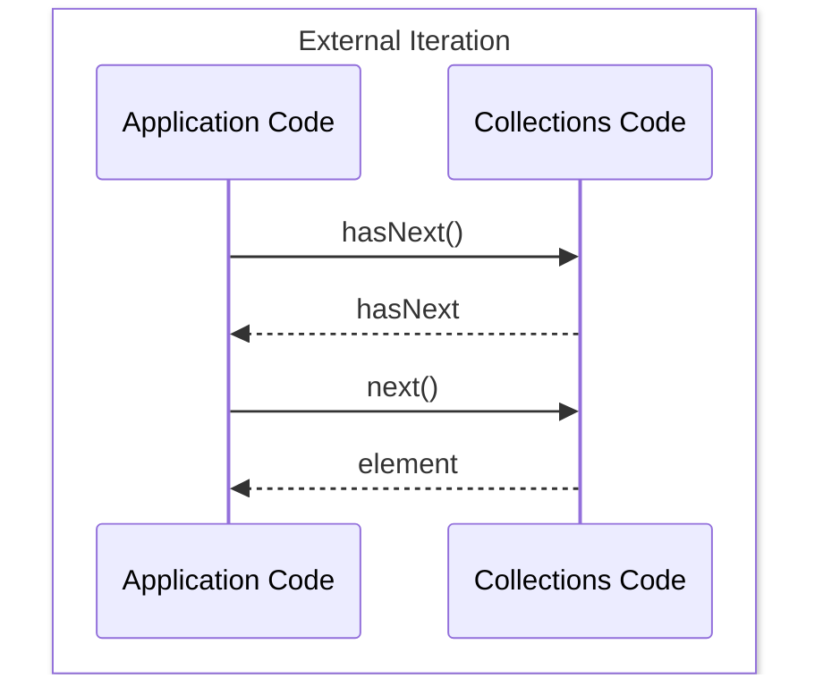
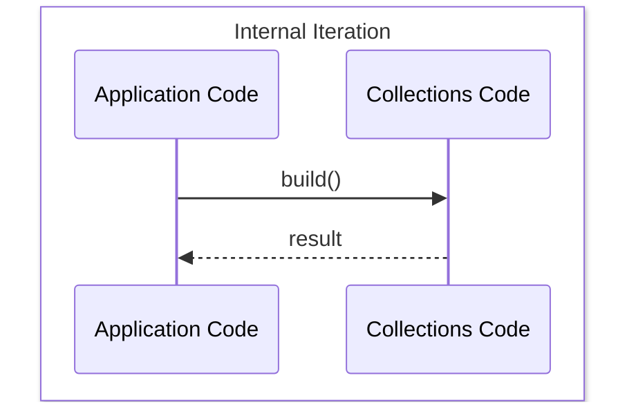

- [Using External Iteration](#using-external-iteration)
- [Internal Iteration Using Streams](#internal-iteration-using-streams)
- [Lazy and Eager filters](#lazy-and-eager-filters)
In this tutorial, we will explore different kinds of iterations using code examples

## Using External Iteration
Lets say we want to count the liverpool based artists, we could do:
```
int count=0;
for(Artist artist : allArtists){
    if(artist.isFrom("liverpool")){
        count++;
    }
}
```
Now we are internally using the iterator to iterate over the artists.
So, technically under the hood, its doing the following:
```
int count=0;
Iterator<Artist> iterator = allArtists.iterator();
while(iterator.hasNext()){
    Artist artist = iterator.next();
    if(artist.isFrom("liverpool")){
        count++;
    }
}
```
- This is "external" iteration
- Its inherently "serial" in nature.

Below diagram explains the essence of "External" Migration


## Internal Iteration Using Streams
The  same can be achieved using Streams as follows:
```
allArtists 
.stream()
.filter( artist -> artist.isFrom("liverpool"))
.count();
```
## Lazy and Eager filters
Consider the above example again:
```
allArtists 
.stream()
.filter( artist -> artist.isFrom("liverpool"))
.count();
```
Here filter is a  *lazy* method and count is an *eager* method.
Since filter is lazy, if we add a print statement inside it, we won't see anything printed!!

Lets try the following to test this!
```
List<String> allArtists = Arrays.asList("George","Paul","Ringo","John");
    allArtists.stream().filter( artist -> {
    System.out.println("Hello World!"); // doesn't print this due to Lazy evaluation
    return artist.contains("john");
});
```
As you can see above, "Hello World!" doesn't get printed.
Now,if we add the count() which a eager method, it'll print Hello World!

```
 List<String> allArtists = Arrays.asList("George","Paul","Ringo","John");
 long count = allArtists.stream().filter( artist -> {
    System.out.println("Hello World!"); //Prints Hello World!
    return artist.contains("John");
}).count();
System.out.println(count); //Prints 1
```

To be more specific, 

    1. if the method (or operation) returns you a Stream, its Lazy.
    2. If it gives back a value or void, its eager

So, ideally we'll have a sequence of lazy operations chained together and a single eager operation at the end.

This is similar to the builder pattern.
So in case of Streams, its "internal" iteration. 
We are only calling build operations and then getting back results.

Below diagram explains the essence of "Internal" Migration

