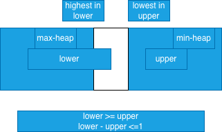

## DSA quick messy notes
- Writing your own understanding is important.
- Each person has his own perspective on the algorithm logic. So even if messy notes, its still a good idea.
- For quick testing or validation, use online IDE like: https://www.onlinegdb.com/online_java_compiler

### write program to print all permutations of {1,2,3}
permute(arr, l ,r) , initially l=0, r=arr.length-1
- iterate i from l to r
    - swap(arr,l,i)
    - permute(arr,l+1,r), // l is fixed, so we permute on the rest of array
    - again swap(arr,l,i),  //why? backtracking it to original state

- base case(when to break recursion): 
     l==r, you have reached one end of permutation, print the array

Example iteration
- [1,2,3]
    - initial pass, 
        - now it'll permute on (2,3) keeping 1 fixed
            - [1,2,3]
            - [1,3,2]
    - second pass, [2,1,3]
    - now it'll permute on (1,3) keeping 2 fixed.
        - [2,1,3] 
        - [2,3,1] 
        - backtracked to [1,2,3]
    - third pass, [3,2,1]
        - permute on (2,1) keeping 3 fixed
        - [3,2,1] 
        - [3,1,2] 
    


# find median in a stream of numbers
- 
- Suppose we have a array like below :
   - [   lower half  | middle | upper half    ]
    - If array length is odd, middle element is the median
    - If array length is even, we have to think, how to calcualte.
 - We could maintain highest element in lower half  ( max-heap)
 - We could maintain lowest element in upper half  ( min-heap)
  - Now, lets propose lower includes the middle element as well if present.
   - In case the array is odd, lower.size (since it includes middle element) > upper.size
        - Also, lower.size - upper.size <=1 ( it cannot exceed 1)
        - In case the array is even, lower.size = upper.size (even or perfect split!)
        - So there is some balancing work to be done in arrays so that the above rules are satisfied.
        - Eg: if upper heap had [7], lower heap had [5] and a new number came as 10
            - we always check if it can be put in lower heap, if not, we put it in upper.
            - since 10 >5, it'll go to upper 
            - min-heap in upper is [7,10]
            - but upper is having more eleemnts than lower
            - So we need to pop() from upper and put it in lower
                - upper : [10]
                - lower: [7,5]
                - Now median is 7, since array is odd , so simply peek() the lower.
        - Eg2: if upper heap had [7,10], lower heap had [5] and a new number came as [3]
            - since 3<5, it'll go to lower
            - lower : [5,3]
            - upper: [7,10]
            - Since array is now even, it'll be average of peeks. So (5+7)/2 = 6.


# find k-largest numbers (add and then poll strategy)
- It seems counter-intuitive to use a min-heap for largest numbers!
  - First insert 'k' numbers into a min-heap
  - min-heap is one where every node is lower than its children.
- eg: k=3, arr= [10,4,2,6,5,1]
    - we insert 3 numbers to our min-heap
    - [10] 
    - [4,10]
    - [2,4,10]
- Now, comes 6
    - First add 6 to the min-heap
    - [2,4,6,10]
    - since heap.size > k, we poll() the root element (smallest one)
    - Say, its now [4,6,10]
- Now comes 5
    - Add 5 to the min-heap
    - [4,5,6,10]
    - since heap.size > k, we poll() the root element (smallest one)
    - [5,6,10]
- Now comes 1
    - Since 1 < top/peek element, we simply ignore
- So the k-largest elements are 5,6,10

- Additionally Now to print k-largest elements, we need to do poll()
 - Because the min-heap could have [5,10,6] as well 
    - since 5 < both 10 and 6 and its not a BST but just a binary tree
    - poll() removes the element and then adjust the heap to have the next min element at the top    

- Here since we add every element irrespective of whether its required or not, so it takes more heapify() operations.
- But this approach is **simple** to code with **less conditionals**.

```java
for (int n : nums) {
    minHeap.add(n);
    if (minHeap.size() > k) {
        minHeap.poll();
    }
}

```
## Java Priority Queue Samples
- by default, PriorityQueue in Java is a min-heap
```java
PriorityQueue<Integer> minHeap = new PriorityQueue<>();
minHeap.add(10);
minHeap.add(15);
minHeap.add(110);
minHeap.add(5);
System.out.println(new ArrayList<>(minHeap)); //[5, 10, 110, 15]
```
- If we want a max-heap, then we could use a lamda
```java
PriorityQueue<Integer> maxHeap = new PriorityQueue<>((a,b)-> b.compareTo(a));
maxHeap.add(10);
maxHeap.add(15);
maxHeap.add(110);
maxHeap.add(5);
System.out.println(new ArrayList<>(maxHeap)); //[110, 10, 15, 5]
```

### Heap Definitions
 - max-heap: parent>=children
 - min-heap: parent<=children 

---

### Longest string without repeating characters
- say "abcabcbb", longest string is "abc"
- use a map
- initialize left and right to 0 (beginning)
- while right< arr.length
    - if you see a unique character, 
        - add character to map along with index
    - else if you see a duplicate character in map,
        - left = max(left,map.get(duplicatechar)+1) //Note: eg2 explains why max is required
        - update index for that character in map
    - calculate the max string after each step
    - right++

- eg1: "abcabcbb"
- map: {a:0, b:1,c:2}, l=0, r=2
    - maxString="abc"
- now "a" is already there in map
    - l = a's previndex + 1 = 1, 
    - l=1, r=3, updated map: {a:3,b:1,c:2}, len=3, maxString="bca"
    - and so on.
 
 - eg2: "abcbad"
    - map:{a:0,b:1,c:2}, l=0, r=3
    - now, it's b repeating
    - l = b's index+1 = 1+1 =2 , r=3
    - so, l=2, r=3, map: {a:0, b:3, c:2}
    - The resulting string is "cb"
    - Now we see 'a', which is also present in map
    - But a's index is 0 while l=2 ( left is already ahead of a), so we shouldn't do a's index+1
    - l remains 2 due to max logic, l=2, r=4 ("cba")
    - map is updated {a:4,b:3,c:2}
    - now we see "d" which isn't there in map, so "cbad"
        - map : {a:4,b:3,c:2,d:5} 

#### calculate max string using left,right, maxLen, maxString
- calculate the string length so far using (right-left+1)
- if this new length is greater than maxLen, update maxString and maxLen.
- maxString is the str.substring(left,right+1)