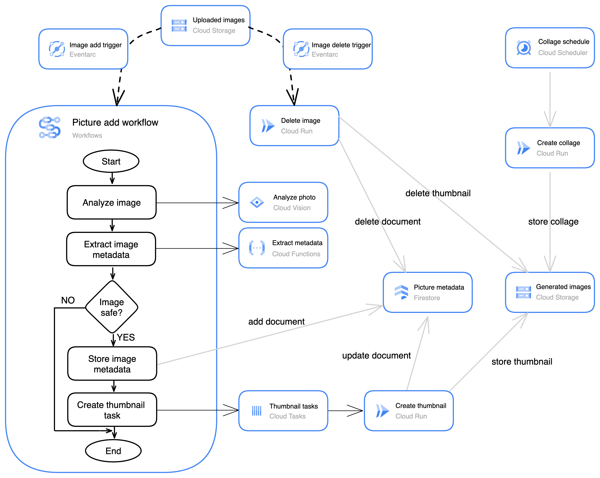

## Step-by-step thumbnail creation flow

### 1️⃣ Image is uploaded to Cloud Storage

* A user uploads an image to a **Cloud Storage bucket**
* This is the starting point of the entire flow

---

### 2️⃣ Eventarc triggers the workflow

* **Eventarc** detects the *object finalized* (image upload) event
* Eventarc **starts a new execution of the Google Cloud Workflow**
  (Picture add workflow)

➡️ At this point, **Workflows is the orchestrator**

---

### 3️⃣ Workflow analyzes the image (synchronous steps)

Inside the **Picture add workflow**:

1. **Analyze image**

   * Workflow calls **Cloud Vision API**
   * Vision returns labels, text, and SafeSearch results

2. **Extract image metadata**

   * Workflow calls a **Cloud Run Function**
   * The function extracts and normalizes metadata

3. **Decision: “Is image safe?”**

   * Workflow evaluates the Vision SafeSearch response
   * This is a normal workflow decision step

⚠️ All of the above steps are **synchronous**:

* Workflow waits for each call to return
* This is safe because they are short-lived operations

---

### 4️⃣ Metadata is stored in Firestore

If the image is safe:

* Workflow writes image metadata to **Firestore**
* Firestore now becomes:

  * metadata store
  * workflow state reference

---

### 5️⃣ Workflow queues thumbnail creation (key step)

This is where thumbnail creation **begins**, but **not inline**.

* Workflow **creates a Cloud Task**
* The task payload contains:

  * image location
  * image ID / metadata reference

📌 **Important design choice**:

* Workflow does **not** create the thumbnail itself
* Workflow does **not wait** for thumbnail creation

Instead:

> Workflow delegates execution to Cloud Tasks

---

### 6️⃣ Cloud Tasks triggers thumbnail service

* Cloud Tasks delivers the task to a **Cloud Run service**
  (Create thumbnail)

Cloud Tasks guarantees:

* reliable delivery
* retries on failure
* backoff handling

This is **command-style execution**:

> “Create a thumbnail for this image.”

---

### 7️⃣ Cloud Run service creates the thumbnail

The **Create thumbnail** service:

1. Reads the original image from **Cloud Storage**
2. Generates a thumbnail
3. Stores the thumbnail back in **Cloud Storage**
4. Updates the image document in **Firestore**

   * e.g. `thumbnailCreated = true`
   * or thumbnail path

---

### 8️⃣ Workflow execution ends

* The workflow execution **ends earlier**, right after queuing the task
* Thumbnail creation happens **asynchronously**
* Any client/UI can later read Firestore to see:

  * thumbnail status
  * thumbnail URL

---

## Why this design is correct (and intentional)

### Why not create the thumbnail directly in the workflow?

Because thumbnail creation:

* can take longer
* may fail and need retries
* should not block orchestration

Cloud Tasks + Cloud Run is better suited for:

* execution
* retries
* isolation

---

## Key orchestration principles demonstrated

| Component             | Role                           |
| --------------------- | ------------------------------ |
| Cloud Workflows       | Orchestrates logic & decisions |
| Eventarc              | Starts the workflow            |
| Cloud Vision          | Fast synchronous analysis      |
| Firestore             | Metadata + state store         |
| Cloud Tasks           | Reliable async execution       |
| Cloud Run (thumbnail) | Does the actual work           |

---
