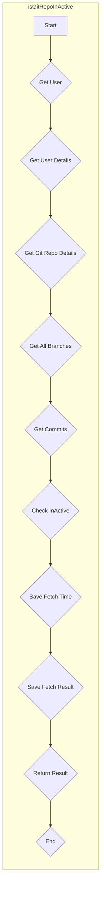

### Prompt Used in Google Code Assist
generate a mermaid flow diagram. Do not use any special characters like "<," ">", ":",",",":",")","(","." in the mermaid code. Use underscore whenever applicable. Make sure the mermaid code works properly.

## Sample Response

