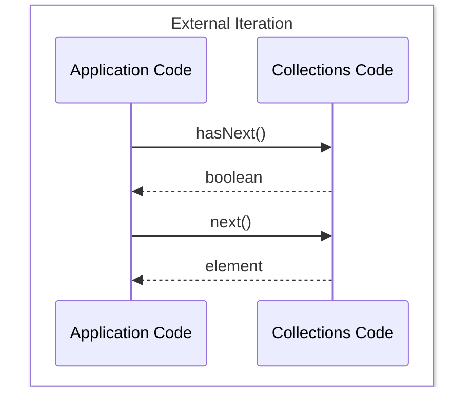
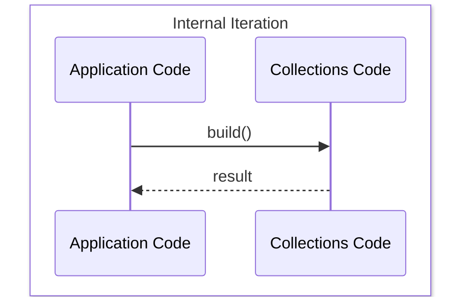

# **Java 8 — Part 2: Iterations**

In this tutorial, we’ll explore different types of iterations in Java, comparing the traditional approach (Java 7) with the modern Stream-based approach introduced in Java 8.

---

## **External Iteration (Java 7 Way)**

Let’s say we want to count the number of artists based in Liverpool. In Java 7, we’d typically write:

```java
int count = 0;
for (Artist artist : allArtists) {
    if (artist.isFrom("liverpool")) {
        count++;
    }
}
```

Under the hood, this loop uses an **iterator** to traverse the collection:

```java
int count = 0;
Iterator<Artist> iterator = allArtists.iterator();
while (iterator.hasNext()) {
    Artist artist = iterator.next();
    if (artist.isFrom("liverpool")) {
        count++;
    }
}
```

### Key Points

* This approach is known as **external iteration**, since the application code explicitly controls the iteration process.
* It is inherently **serial** in nature — one element is processed at a time.

### Diagram: External Iteration



---

## **Internal Iteration (Using Streams in Java 8)**

The same logic can be implemented in Java 8 using **streams**, which handle iteration internally:

```java
allArtists.stream()
    .filter(artist -> artist.isFrom("liverpool"))
    .count();
```

Here, you simply describe **what** to do, and the stream API decides **how** to do it.

---

## **Lazy vs. Eager Operations**

Let’s understand two important concepts in the context of streams — **lazy** and **eager** operations.

### Thumb Rule

1. If a method returns a **Stream**, it is **lazy**.
2. If it returns a **value** (or `void`), it is **eager**.

For example:

* `filter()` → returns a `Stream` → **lazy**
* `count()` → returns a `long` → **eager**

Because `filter()` is lazy, it doesn’t execute until an eager operation (like `count()`, `collect()`, etc.) triggers it.

### Example: Lazy Evaluation

```java
List<String> allArtists = Arrays.asList("George", "Paul", "Ringo", "John");

allArtists.stream()
    .filter(artist -> {
        System.out.println("Hello World!"); // Won't print due to lazy evaluation
        return artist.contains("John");
    });
```

The message `"Hello World!"` will **not** print, because no eager operation was invoked.

Now, let’s add an eager operation (`count()`):

```java
List<String> allArtists = Arrays.asList("George", "Paul", "Ringo", "John");

long count = allArtists.stream()
    .filter(artist -> {
        System.out.println("Hello World!"); // Prints "Hello World!"
        return artist.contains("John");
    })
    .count();

System.out.println(count); // Prints 1
```

### Key Takeaways

* A **stream pipeline** consists of a sequence of lazy operations followed by a single eager (terminal) operation.
* This design is conceptually similar to the **Builder pattern** — you chain setup operations, and the final call executes everything.

---

## **Diagram: Internal Iteration**



---

### **Summary**

| Concept                | Description                               | Example                      |
| ---------------------- | ----------------------------------------- | ---------------------------- |
| **External Iteration** | Application manually controls traversal.  | `for` loop or `Iterator`     |
| **Internal Iteration** | Stream API controls traversal internally. | `.stream().filter().count()` |
| **Lazy Operation**     | Returns a Stream; execution deferred.     | `filter()`, `map()`          |
| **Eager Operation**    | Returns a value; triggers execution.      | `count()`, `collect()`       |


