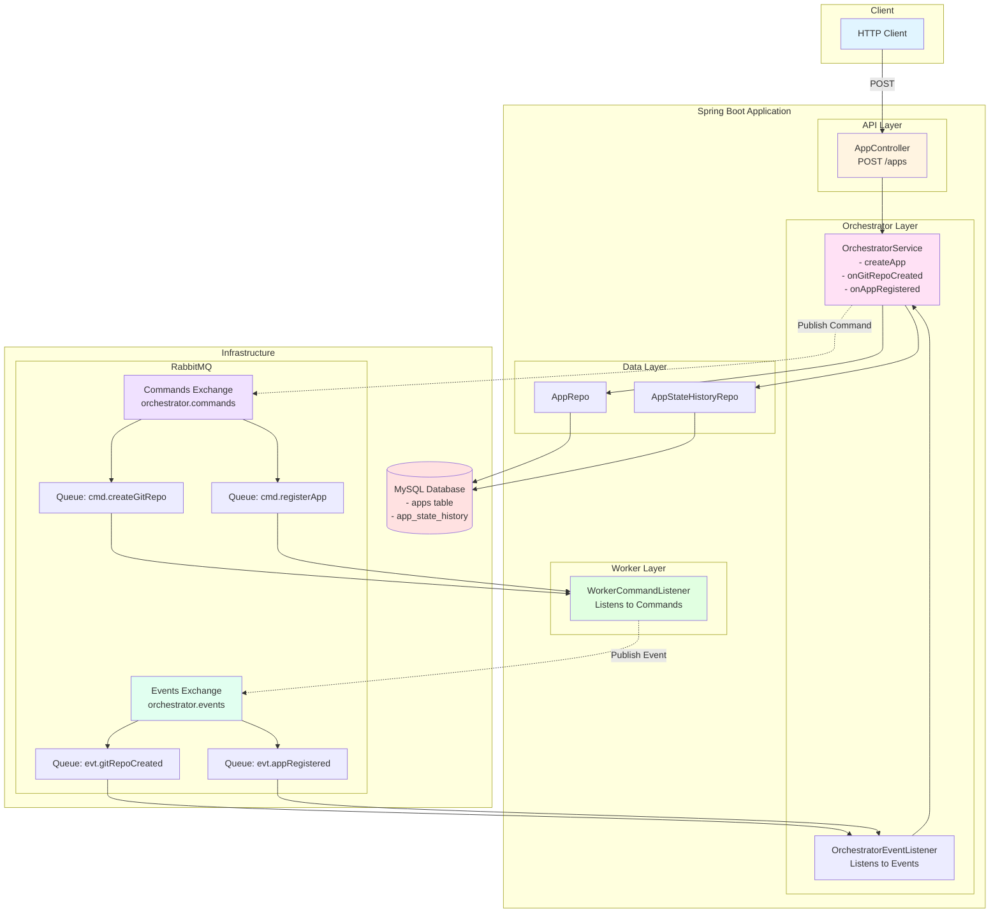
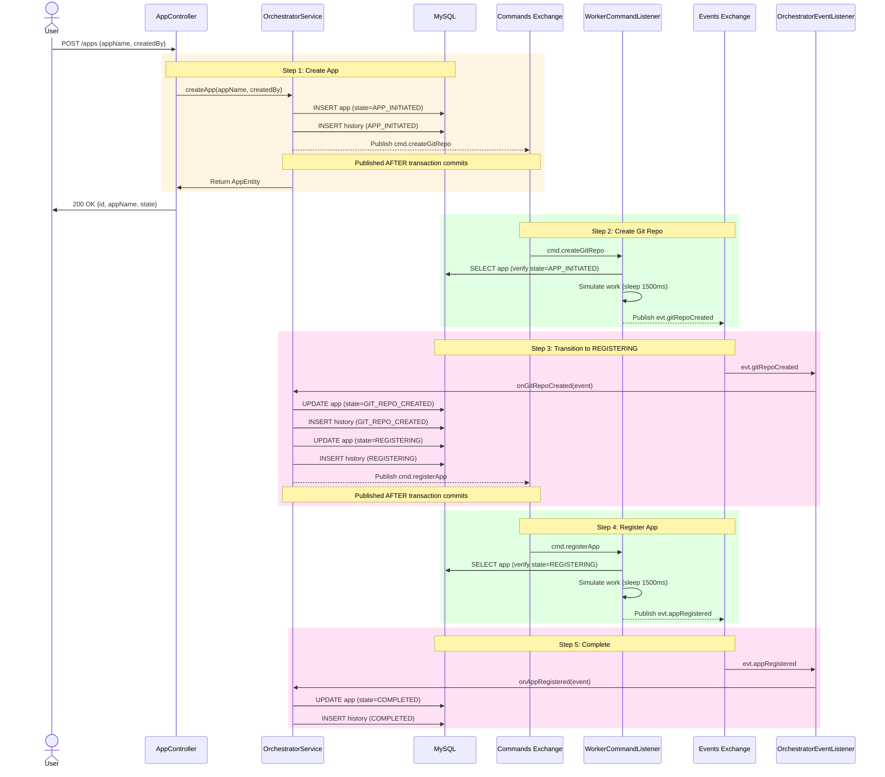
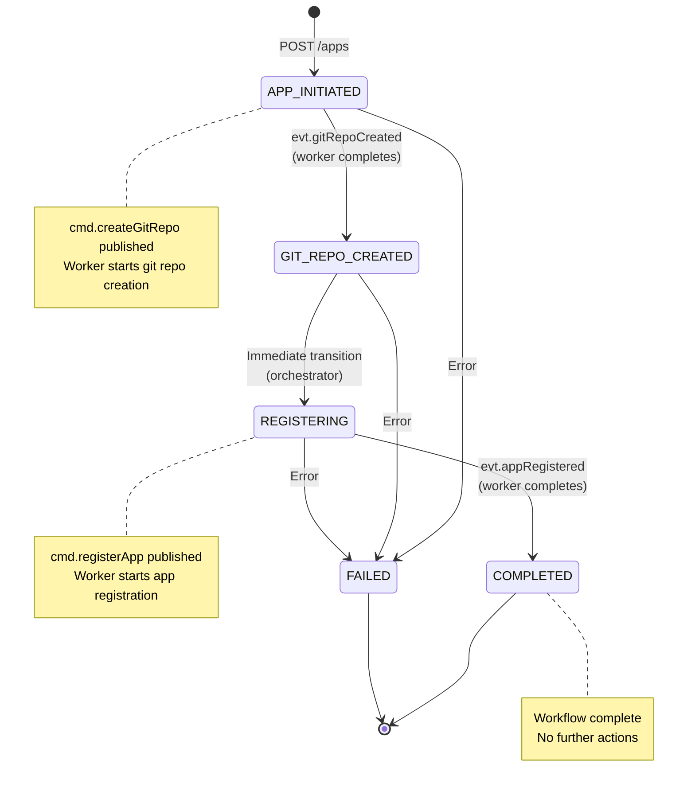
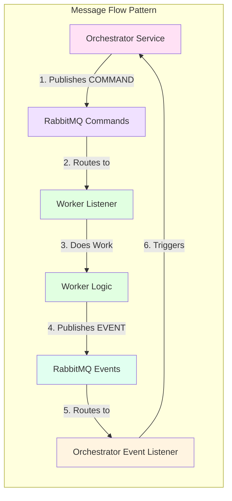
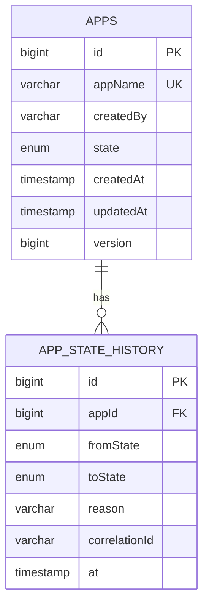
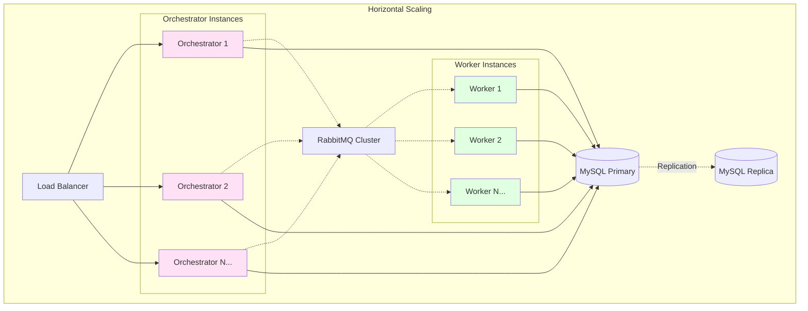

# Orchestrator System Design Diagram

## Architecture Overview



## Sequence Diagram - Complete Flow



## State Machine Diagram



## Component Interaction Map



## Data Model



## Key Design Decisions

### 1. Event-Driven Architecture
- **Pattern**: Command/Event Segregation
- **Commands**: Imperative actions for workers (cmd.createGitRepo, cmd.registerApp)
- **Events**: State change notifications (evt.gitRepoCreated, evt.appRegistered)
- **Benefit**: Loose coupling between orchestrator and workers

### 2. Transaction Safety
- **Problem**: Race condition between DB commit and message consumption
- **Solution**: Publish commands AFTER transaction commits using `TransactionSynchronizationManager`
- **Result**: Workers always see committed state when processing commands

### 3. Idempotency Guards
- **Workers**: Check expected state before processing (prevents duplicate work)
- **Orchestrator**: Ignores events if already in later state (handles retries)

### 4. Correlation IDs
- **Purpose**: Track request flow across async boundaries
- **Usage**: Every command/event carries correlationId for debugging
- **Benefit**: Easy to trace entire workflow in logs

### 5. State History
- **Table**: app_state_history tracks all transitions
- **Value**: Audit trail, debugging, analytics
- **Pattern**: Event Sourcing lite

## Scalability Considerations



### Scale-out Strategy:
1. **API Layer**: Stateless - scale horizontally behind load balancer
2. **Orchestrator**: Stateless - multiple instances can process events concurrently
3. **Workers**: Stateless - RabbitMQ distributes work across instances (competing consumers)
4. **Database**: Single writer with read replicas for queries
5. **RabbitMQ**: Cluster for high availability

## Message Guarantee Levels

| Component | Guarantee | How |
|-----------|-----------|-----|
| **Database** | Exactly-once state change | ACID transactions + optimistic locking |
| **RabbitMQ** | At-least-once delivery | Durable queues + publisher confirms |
| **Worker Idempotency** | Safe retry | State guards prevent duplicate work |
| **Overall System** | Eventual consistency | Idempotent handlers + correlation tracking |

---

## How to View These Diagrams

These diagrams use Mermaid syntax. View them using:

1. **GitHub/GitLab**: Renders automatically in markdown files
2. **VS Code**: Install "Markdown Preview Mermaid Support" extension
3. **IntelliJ IDEA**: Built-in Mermaid support in markdown preview
4. **Online**: Paste into https://mermaid.live
5. **CLI**: Use `mmdc` (mermaid-cli) to generate PNG/SVG

Example to generate PNG:
```bash
npm install -g @mermaid-js/mermaid-cli
mmdc -i system-design-diagram.md -o architecture.png
```
